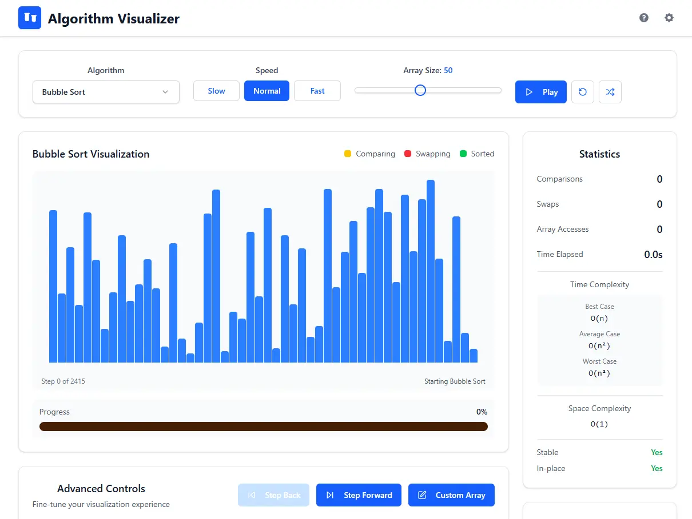

# 🧪 Sorting Algorithm Visualizer

A sleek and interactive web application that visualizes popular sorting algorithms in action. Adjust speed, change the array size, view real-time statistics, and step through the logic line-by-line — all in a beautifully animated UI.

🌐 **Live Demo**: [sortvisualizer.netlify.app](https://sortvisualizer.netlify.app)



---

## 🚀 Features

- 📊 **Visualize Sorting Algorithms**: Bubble Sort, Selection Sort, Insertion Sort, and more.
- 🐢🐇 **Control Speed**: Switch between Slow, Normal, and Fast modes.
- 🔀 **Randomize or Customize Arrays**: Shuffle existing data or input your own.
- 🎛️ **Adjust Sample Size**: Dynamically change the size of the array being sorted.
- ⏯️ **Interactive Controls**: Play, pause, step forward/backward, or reset the animation.
- 📈 **Live Stats**: Track comparisons, swaps, accesses, and time.
- 🧠 **Pseudocode Execution**: Watch the algorithm logic unfold line-by-line.
- 📦 Built using **React 19**, **Vite**, **Tailwind CSS**, and **Radix UI**.

---

## 📦 Tech Stack

- **Frontend**: React + Vite
- **Styling**: Tailwind CSS + Lucide Icons
- **UI Components**: Radix UI (Progress, Slider, Select)
- **Type Safety**: TypeScript
- **Linting**: ESLint + TypeScript ESLint Plugin

---

## 🛠 Installation

```bash
# Clone the repository
git clone https://github.com/your-username/sorting-visualizer.git
cd sorting-visualizer

# Install dependencies
npm install

# Start the dev server
npm run dev
